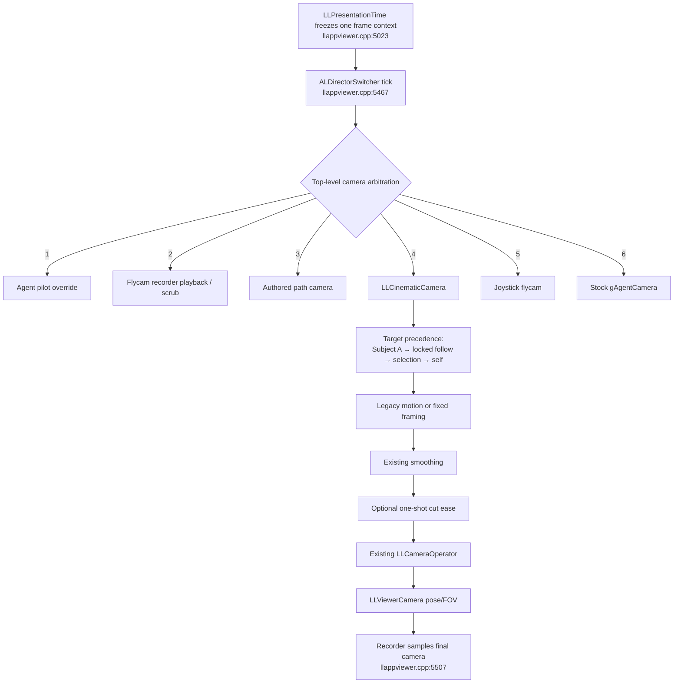

# Director Camera Switcher — Expanded Research and Implementation Report

**Source brief:** `doc/DIRECTOR_CAMERA_SWITCHER_DEEP_RESEARCH.md`

**Target:** Alchemy-Machinima `develop`

**Research/code date:** 2026-07-30

**Delivery mode:** source patch only; no configure, compile, link, test executable, or viewer build was run.

## 1. Outcome

The recommended implementation is a 12-source, cut-bus-style Director switcher layered on the existing `LLCinematicCamera`, not a new render-camera owner. Each bank slot stores one stable CineCam mode integer and can therefore select any legacy motion mode or one of eight appended fixed framings. Tight, OTS, and Two-Shot reuse the existing modes 19, 10, and 17.

The implementation has four layers:

1. `ALDirectorSwitcherModel`: renderer-independent, absolute-presentation-time scheduling and addressed random decisions.
2. `ALDirectorSwitcher`: settings/bank adapter, live program state, camera-enable ownership, ACTION/CUT cooperation, and manual punch API.
3. `LLCinematicCamera`: effective-mode consumption, tunable fixed-shot geometry, cut serial/phase reset, and the optional one-shot pose/FOV ease.
4. `ALPanelDirectorSwitcher`: shared 12-button bank editor embedded in the Director Console.

Hard cuts are the default. Auto is off by default. The live arm is session-only and starts false on every launch. The switcher does not write `CinematicCamMode`, so the operator's ordinary persisted CineCam selection survives switcher use.

## 2. Corrections to the source brief

Several assumptions in the brief do not match this tree:

1. **`UseCinematicCamera` is not the automated CineCam dispatch gate.** It is Black Dragon's third-person cinematic *head-tracking* option. It is copied to `LLAgentCamera::mCinematicCamera` in `llagentcamera.cpp:221-227`, affects head focus/up-vector math at `llagentcamera.cpp:1599-1609,1634-1650`, and has its own listener at `llviewercontrol.cpp:287-291,1143-1148`. It is unrelated to `LLCinematicCamera` and the switcher must never touch it.
2. **The real top-level camera dispatch is in `LLAppViewer::idle()`, not `LLAgentCamera`.** The current priority is pilot override → recorder playback → path camera → `LLCinematicCamera` → joystick flycam → stock agent camera. The patched dispatch remains at `llappviewer.cpp:5470-5504`.
3. **The persisted `CinematicCamMode` default is 2 (Orbit), not 1.** The `LLCachedControl` fallback is 1 only if the setting is missing. The actual patched setting is at `settings.xml:1889-1899`.
4. **There is no `CinematicCamSpeed`.** Motion modes carry their own speed/duration settings; the legacy global phase is accumulated from clamped `gFrameIntervalSeconds`. The patch preserves that exact legacy branch when the switcher is not driving.
5. **The current Director does save `CinematicCamMode`.** It is deliberately outside the generic settings list, but `saveScene()` writes `scene["cinecam_mode"]` and `loadScene()` restores it explicitly (`llfloaterdirector.cpp:698-737,790-803`).
6. **The old Director mode-name helper covered only modes 0–22.** Modes 23–42 could display `"?"`. The patch centralizes all names 0–50 in `LLCinematicCamera::modeName()` (`llcinematiccamera.cpp:138-166`).
7. **The old Director hotkey hook ran too late for number punches.** Printable-key auto-chat consumed 1–9 first. The hook is now after focused UI, tools, and gestures but before printable auto-chat (`llviewerwindow.cpp:3427-3445`), with an explicit keyboard-focus gate because line editors receive printable content through the later Unicode path.

These corrections materially change the architecture: only `CinematicCamEnabled` and the existing `LLCinematicCamera` branch are relevant to switcher takeover.

## 3. Existing camera stack, as implemented



### 3.1 Arbitration and recorder coexistence

The switcher ticks immediately before arbitration (`llappviewer.cpp:5467-5468`) but does not insert a new branch. Pilot, recorder playback, and path-camera owners still pre-empt CineCam. When pre-emption ends, CineCam presents the schedule's current program source; a stale ease is suppressed after a multi-frame gap. Recorder capture already samples the final arbitrated camera after dispatch (`llappviewer.cpp:5507`), so a recorded take naturally captures switcher cuts without new recorder coupling.

### 3.2 Activation and target resolution

`LLCinematicCamera::isActive()` requires `CinematicCamEnabled`, a valid effective mode, and a resolvable target (`llcinematiccamera.cpp:187-202`). While the switcher drives, its snapshotted live mode replaces only the mode read; otherwise the legacy persisted mode is used.

Target resolution is unchanged (`llcinematiccamera.cpp:224-260`):

1. live Director Subject A;
2. session locked-follow subject;
3. selected avatar or attachment owner when `CinematicCamUseSelected` is on;
4. the agent avatar.

`resolveAnchor()` remains the shared joint/fallback transform for Flycam Orbit and other riders (`llcinematiccamera.cpp:263-293`). The switcher deliberately has one shared live subject; per-slot targets are outside v1.

### 3.3 OTS and Two-Shot failure behavior

Existing `patternOTS()` and `patternTwoShot()` already fail soft. Subject B is preferred when available. Without a distinct second body, the code constructs stable subject-relative forward/profile geometry rather than dereferencing a missing actor. This deliberately preserves the established modes instead of adopting the brief's suggested Close fallback or disabling the slot: the source stays punchable and the framing remains safe, but it is synthetic rather than a true two-person composition (`llcinematiccamera.cpp:616-650,741-788`).

## 4. Research basis and design consequences

### 4.1 Broadcast switching semantics

Blackmagic's current ATEM documentation distinguishes direct cut-bus operation from program/preview operation: a cut-bus source button takes a source directly to air, while program/preview is a two-stage selection and CUT. See the [ATEM Mini manual](https://documents.blackmagicdesign.com/UserManuals/ATEM_Mini_Manual.pdf).

This v1 intentionally implements the simpler **cut bus**:

- a bank button is an immediate program punch while armed;
- while disarmed, the same button selects a slot for editing;
- pressing the already-live source is a no-op, matching a program-bus source that is already on air;
- after Director CUT, pressing that same source is a real resume/take and re-anchors its motion and auto interval.

A separate preview row, tally protocol, and preview/program swap would be a coherent v2, but are not required for the requested direct camera selection.

### 4.2 Separate shot grammar from camera geometry

Microsoft Research's [Virtual Cinematographer](https://www.microsoft.com/en-us/research/publication/the-virtual-cinematographer-a-paradigm-for-automatic-real-time-camera-control-and-directing/) separates high-level idioms that select shot types/timing from reusable camera modules that perform low-level placement. That maps cleanly to this fork:

- the switcher model decides *when* and *which slot*;
- the bank maps the slot to a shot vocabulary;
- `LLCinematicCamera` remains the only low-level camera-placement module.

This is why the scheduler is renderer-independent and why the implementation does not create twelve persistent virtual camera objects.

### 4.3 Stateless time and addressed randomness

The W3C [Web Animations timing model](https://www.w3.org/TR/web-animations-1/) describes the useful properties of deriving output from input time rather than prior samples: frame-rate independence, direction agnosticism, and potentially constant-time seeking. The [Random123 counter-based RNG design](https://random123.com/) similarly obtains the Nth random value by mixing an address/counter instead of consuming mutable RNG state.

The switcher follows those principles:

- presentation time is the only schedule clock;
- SplitMix64 lanes are addressed by seed, salt, event/cycle index, and lane;
- a hitch never consumes a variable number of RNG calls;
- a backward time seek or effective configuration edit explicitly rebases;
- a large forward jump finds the final due event directly and emits at most one presentable cut.

### 4.4 Cut versus blend

Unity's [Cinemachine transition documentation](https://docs.unity.cn/Packages/com.unity.cinemachine%403.1/manual/concept-camera-control-transitions.html) treats a cut as instantaneous and a blend as an interpolation of position, rotation, and camera settings. Epic's [Set View Target with Blend](https://dev.epicgames.com/documentation/en-us/unreal-engine/BlueprintAPI/Game/Player/SetViewTargetwithBlend) likewise exposes blend time and curve.

Accordingly, this implementation keeps a true zero-duration hard cut as the default. The optional transition is a bounded one-shot envelope over position, quaternion, and FOV—not a fade/dissolve and not a second camera owner.

### 4.5 Shot vocabulary

Adobe's [camera shots and angles guide](https://www.adobe.com/ca/creativecloud/video/production/cinematography/camera-shots-and-angles.html) supports the semantic vocabulary used here: wide/medium/close coverage, OTS/two-shot dialogue grammar, profiles, and the power implications of low and high angles. Those labels are editorial intent; the actual meter/FOV values below are authored for the viewer's existing avatar scale and camera conventions and should be tuned in-world after build.

## 5. Deterministic scheduler contract

The pure model is in `aldirectorswitchermodel.h:18-99` and `aldirectorswitchermodel.cpp:18-408`.

### 5.1 Time boundaries

Let:

- `A` be the presentation-time anchor established by arm, manual punch, ACTION resume, seek, or configuration edit;
- `I` be the sanitized interval;
- `J` be jitter, clamped to `0 ≤ J ≤ 0.45 I`;
- `j(p)` be an addressed deterministic sample in `[-J,+J)`.

Pair-balanced boundaries are:

```text
B(2p)   = A + 2pI + I + j(p)
B(2p+1) = A + 2(p+1)I
```

Thus each pair has intervals `I+j(p)` and `I-j(p)`: each interval stays in `[0.55I,1.45I]`, boundaries remain ordered, and every completed pair returns exactly to the nominal timeline. `eventBoundary()` implements this at `aldirectorswitchermodel.cpp:133-161`.

Because a boundary is displaced by at most `0.45I`, the final due boundary around `floor((now-A)/I)` can only be the neighboring nominal candidates. `findLastDueEvent()` checks that bounded set (`aldirectorswitchermodel.cpp:163-205`), so a very large hitch is still O(1) with respect to elapsed events.

### 5.2 Slot selection

- **Sequence:** find the first enabled bank slot after the source live at the anchor, then advance by event index and wrap (`aldirectorswitchermodel.cpp:221-259`).
- **Random:** create a seed/cycle-addressed Fisher–Yates permutation of enabled slots. Each cycle uses every enabled slot once. Boundary swaps prevent adjacent repeats, including across cycles; the two-slot case uses a stable alternating orientation (`aldirectorswitchermodel.cpp:261-322`).
- **Zero enabled slots:** no auto cut.
- **One enabled slot:** every elapsed boundary is still a take and re-anchors the mode. This matters for retriggering one-shot motion.
- **Manual punch:** auto-disabled slots remain manually valid; a real manual take restarts the interval.

`Controller::manualPunch()` is the model's low-level re-anchor primitive. The runtime invokes it only after deciding that the requested punch is a real take; an already-live program source is a runtime no-op unless the camera is resuming after CUT. `Controller::update()` emits the final due event at `aldirectorswitchermodel.cpp:331-407`. The runtime forces every emitted boundary through the cut path, even if a large hitch lands on the same slot/mode. Fine-grained and hitch evaluation therefore agree on the final phase anchor.

### 5.3 Determinism boundary

The hard requirement—same automatic cut boundaries and slot choices from the same presentation timeline, seed, interval/jitter, order, and enabled set—is satisfied without wall clock, address state, or `gFrameCount`.

The patch also derives switcher-driven motion phase and ease progress from absolute presentation age (`llcinematiccamera.cpp:1447-1517,1678-1696`). The existing one-pole camera smoothing and optional handheld operator retain their legacy render-delta integration. Therefore this report claims deterministic **schedule, selection, authored pattern phase, and ease envelope**, not pixel-identical final camera poses under arbitrarily different render-frame sampling when smoothing/operator effects are enabled.

## 6. Static framing catalog

Eight new persisted enum values are appended at 43–50; legacy values 0–42 do not move (`llcinematiccamera.h:38-102`). `patternStaticShot()` consumes five saved controls per framing: heading, distance, camera height/offset, aim height/offset, and FOV multiplier (`llcinematiccamera.cpp:1212-1407`).

All distances/heights are meters before the existing outer subject-scale transform. Azimuth is relative to avatar facing. FOV is a multiplier of the viewer's default vertical FOV.

| Slot vocabulary | Mode | Default azimuth | Default distance / camera height | Default aim | Default FOV multiplier | Behavior |
|---|---:|---:|---:|---:|---:|---|
| Wide | 43 | +15° | 5.50 / 1.30 | 1.05 above feet | 1.10 | Establishing/full environment |
| Medium | 44 | +15° | 2.20 / 1.45 | 1.35 above feet | 0.82 | Interview/waist-chest coverage |
| Close | 45 | −10° | 1.25 / head level | head joint, fallback 1.55 | 0.70 | Head and shoulders |
| Tight | existing 19 | facing | existing ECU settings | eyes/head | existing default 0.55 | Reuses `patternECU()` |
| OTS | existing 10 | pair-relative | existing OTS settings | subject face | existing | Reuses fail-soft `patternOTS()` |
| Two-Shot | existing 17 | perpendicular to pair | separation-derived | pair midpoint | existing | Reuses fail-soft `patternTwoShot()` |
| Profile L | 46 | +90° | 2.00 / head level | head joint, fallback 1.55 | 0.75 | Left-side silhouette |
| Profile R | 47 | −90° | 2.00 / head level | head joint, fallback 1.55 | 0.75 | Right-side silhouette |
| Low Hero | 48 | +10° | 2.30 / 0.28 | 1.25 above feet | 0.90 | Low, slightly wide power angle |
| High Angle | 49 | +10° | 2.40 / 3.00 | 1.35 above feet | 0.85 | Downward/diminishing angle |
| Full Body | 50 | facing | 4.00 / 1.05 | 0.95 above feet | 0.95 | Boots-to-head figure |

All 40 controls are persisted `F32` settings (`settings.xml:1728-1767`), participate in mode reset and named CineCam preset save/apply (`alpanelcinecamparams.cpp:194-225,389-426`), and are exposed as eight mode-specific overlays in the shared Cine Camera panel (`panel_cinecam_params.xml:81-88,1489-1559`). Wide/Medium/Low/High/Full heights are measured from the subject base; Close/Profile offsets are measured from the live head joint with a stable anatomical fallback. Distance and FOV are defensively clamped in camera code as well as bounded in XUI.

The switcher intentionally does not write persisted `CinematicCamMode`. To tune the static mode assigned to a bank slot, select that same mode in the existing CineCam combo and use the controls below the switcher; the live switcher source remains snapshotted. This preserves the operator's ordinary mode while keeping the shared panel and named-preset machinery authoritative.

The fixed shots have no hidden clock. Operators who want subtle life can assign existing mode 42, Breathing Hold, to a bank slot. Global frame-up, dutch angle, clone scaling, target selection, camera smoothing, and handheld operator routing remain composable.

## 7. Cut and ease implementation

Every real take increments a 64-bit cut serial and snapshots `activeSince`. The serial makes two distinct slots carrying the same mode a real cut. In `LLCinematicCamera::updateCamera()` (`llcinematiccamera.cpp:1410-1778`), a serial change resets the shot state and anchors phase to the exact take boundary; a target/mode edit restarts phase at the current presentation sample. Fresh activation after pilot/recorder/path pre-emption resets smoothing, prior velocity, and operator state but deliberately retains the take's phase anchor, so the authored motion resumes at the point the presentation timeline has reached.

Hard cut:

- default `DirectorSwitcherEaseCuts=false`;
- camera pose state is reset and the new shot is written in the same frame;
- settled FOV uses the normal broadcast path.

Optional ease:

- duration is clamped to 0–0.4 seconds;
- the outgoing *currently presented* position, rotation, and FOV are captured once;
- quintic smootherstep blends position and FOV;
- quaternion `nlerp()` uses the engine's shortest-hemisphere implementation;
- intermediate eased FOV samples use `setViewNoBroadcast()` to avoid message churn, then the settled value uses normal `setView()` (`llcinematiccamera.cpp:1757-1773`);
- a stale re-entry after a higher-priority camera pre-emption does not glide backward from an old pose.

## 8. Runtime ownership, ACTION/CUT, and failure safety

`ALDirectorSwitcher` is implemented at `aldirectorswitcher.cpp:55-445`.

### 8.1 Arm/disarm ownership

On arm, the switcher snapshots the effective `CinematicCamEnabled`, enables it through the control system's **unsaved value layer**, resets the model, and takes the first auto-enabled slot (or slot 1 when none are enabled). It does not modify `UseCinematicCamera` or the persisted `CinematicCamMode` (`aldirectorswitcher.cpp:168-243`).

On disarm, it restores the snapshot only if:

1. it actually wrote the camera-enable control; and
2. the current value still equals its last written value.

This conditional restoration avoids overwriting a distinguishable external change. `DirectorSwitcherArmed` is non-persistent, and temporary camera-enable writes do not affect the setting's save value. A normal exit or crash while armed therefore cannot relaunch with a switcher-owned camera enable stuck on.

### 8.2 Director transport handshake

ACTION and CUT already conditionally own `CinematicCamEnabled`. The patch turns the overlap into a symmetric lease: `LLDirectorCast::ownsCameraEnable()` (`lldirectorcast.h:174-179`) tells a switcher armed mid-take to snapshot the value ACTION will eventually restore, while `ALDirectorSwitcher::cameraEnableBaseline()` (`aldirectorswitcher.cpp:436-445`) lets ACTION fired after switcher arm inherit the switcher's hidden operator baseline. `fireAction()` first ticks a just-toggled switcher arm/disarm at the frozen presentation sample, closing same-frame ordering windows. When the lease originated with the switcher, Director's matching writes use the unsaved control layer as well (`lldirectorcast.cpp:628-762`).

- ACTION hook: `lldirectorcast.cpp:710`; resumes and rebases only when `DirectorArmCamera` is on.
- CUT hook: `lldirectorcast.cpp:726`; suspends/rebases even if no other Director subsystem marks the transport running.
- Manual punch after CUT: resumes the camera and creates a fresh take boundary.
- `DirectorArmCamera=false`: ACTION/CUT deliberately leave switcher camera state alone.

### 8.3 Other fail-soft cases

- invalid or unknown-version bank → default bank;
- invalid mode → Orbit;
- malformed/overlong bank → exactly twelve sanitized slots;
- UTF-8 labels → truncated at 40 complete symbols;
- invalid slot/time → no-op (a disarm still releases owned camera state even if that frame's time sample is invalid);
- missing target → `LLCinematicCamera::isActive()` declines ownership;
- no second actor for OTS/Two-Shot → existing stable fallback geometry;
- time moves backward → schedule rebase and hard phase boundary;
- higher-priority camera → wins arbitration without state contention.

## 9. Bank, settings, scenes, UI, and hotkeys

### 9.1 Versioned bank schema

`DirectorSwitcherBank` is one compact LLSD value:

```llsd
{
  version: 1,
  slots: [
    { enabled: true, mode: 43, label: "Wide" },
    ...
  ]
}
```

`enabled` controls auto eligibility only. `mode` is the stable `LLCinematicCamera::EMode` integer, so a separate static/motion discriminator cannot drift from the actual camera vocabulary. Bank load/save and normalization are at `aldirectorswitcher.cpp:83-143`.

### 9.2 Settings

Switcher definitions are grouped with the Director settings (`settings.xml:4143-4259`); the 40 static-framing controls are grouped with the existing CineCam mode settings (`settings.xml:1728-1767`).

| Setting | Default | Persistence | Purpose |
|---|---:|---|---|
| `DirectorSwitcherArmed` | false | session only | live ownership master |
| `DirectorSwitcherAuto` | false | saved | timed switching |
| `DirectorSwitcherBank` | 12 defaults | saved | versioned slot map |
| `DirectorSwitcherIntervalSec` | 8.0 | saved | base interval |
| `DirectorSwitcherJitterSec` | 0.0 | saved | deterministic ± timing variation |
| `DirectorSwitcherSequence` | false | saved | false=random permutation, true=sequence |
| `DirectorSwitcherSeed` | 1337 | saved | addressed timing/selection seed |
| `DirectorSwitcherEaseCuts` | false | saved | hard cut versus quick glide |
| `DirectorSwitcherEaseSec` | 0.25 | saved | bounded ease duration |
| `CinematicCamStatic{Shot}{Parameter}` | catalog above | saved | 8 shots × 5 mode-specific framing controls |

### 9.3 Scene behavior

The scene's bank, auto, timing, selection, seed, and ease settings are included in the Director scene settings list (`llfloaterdirector.cpp:542-584`). `Armed`, active slot, cut serial, and active phase are not scene data. Static geometry follows the existing CineCam contract: it is stored in named CineCam presets, and a Director scene restores it when that preset name is attached to the scene; the 40 values are not duplicated into the generic scene map.

Before applying a scene, `loadScene()` disarms/ticks the switcher and stops active transport (`llfloaterdirector.cpp:739-767`). A scene file can restore a multicamera setup but cannot arm the switcher or restore a live slot merely by being loaded. An attached named CineCam preset can still restore `CinematicCamEnabled` under the pre-existing preset contract.

### 9.4 Shared Director panel

`ALPanelDirectorSwitcher` (`alpaneldirectorswitcher.cpp:39-316`) provides:

- 4×3 program buttons with live tally;
- disarmed select-for-edit behavior;
- per-slot auto eligibility, combined mode list, and label;
- Auto, interval, jitter, random/sequence, seed, ease toggle, and duration;
- reset glyphs using the existing `Machinima.ResetControl` callback.

The switcher panel (`panel_director_switcher.xml:1-274`) is mounted above the existing CineCam controls in the Director Camera tab (`floater_director.xml:877-912`). Those shared controls now include all eight static framing panels, with per-control reset buttons and named-preset participation. No separate floater is needed for v1, so the Director Console is the complete surface.

### 9.5 Hotkeys

Unmodified top-row 1–9 punch slots 1–9 only when:

- Director hotkeys are enabled;
- the Director Console is visible;
- the switcher is armed;
- no UI element has keyboard focus.

Focused UI, tools, and gestures retain precedence. Modified digits and digits sent to an already-focused editor fall through. When the Director is visible and the switcher is armed, an otherwise unmodified top-row digit is intentionally consumed before printable-key auto-chat so it can punch the bank; disarm or hide the Console to type that digit into newly opened chat. Number-key repeats are consumed without repeating the cut; F2–F8 retain their legacy repeat routing. Actor Mover alone does not reserve number keys. The routing is at `aldirectorhotkeys.cpp:33-97` and `llviewerwindow.cpp:3427-3438`; the operator reference is updated at `doc/DIRECTOR_HOTKEYS.md:45-97`.

## 10. Default-off compatibility claim

A literal “byte-identical” claim would be inaccurate: the executable bytes necessarily change, `LLAppViewer` makes one additional singleton/cached-arm check per frame, and active legacy CineCam performs an effective-mode lookup. The defensible claim is:

- with `DirectorSwitcherArmed=false` and legacy mode values 0–42, camera owner selection, target resolution, legacy pattern phase accumulation, smoothing, operator routing, and final camera writes follow the same functional branches and values as before;
- no camera setting is mutated;
- no switcher bank or auto setting is read on the disarmed hot path;
- ordinary number input is unchanged;
- F2–F8 retain their legacy routing, including repeat behavior;
- enum values 0–42 remain stable.

So the patch provides **default-disarmed functional equivalence with near-zero overhead**, not binary/instruction-trace identity.

## 11. Verification and adversarial coverage

Fourteen renderer-independent tests are authored in `tests/aldirectorswitchermodel_test.cpp:57-431`:

1. finite/bounded sanitization;
2. auto-off and empty-bank quiet states;
3. exact-boundary idempotence;
4. enabled-only sequence/wrap;
5. disabled-slot manual punch and rebase;
6. backward seek;
7. configuration/auto changes;
8. matched-controller deterministic equality;
9. random full permutations and no adjacent repeats;
10. first random event avoids the manual source;
11. pair-balanced jitter bounds;
12. large-hitch versus fine-timeline final event;
13. invalid time/rebase/reset safety;
14. manual anchor before first configuration sample.

The adversarial source review additionally covered:

- same-mode/different-slot cuts;
- hitch final event returning to the same slot;
- one-source auto takes;
- keyboard-focus Unicode routing;
- repeat suppression;
- ACTION-owned camera state when arming mid-take;
- CUT while transport is otherwise idle;
- crash/restart persistence;
- higher-priority camera pre-emption;
- scene load while armed/running;
- malformed/unknown bank data;
- enum/name-count stability;
- intermediate versus settled FOV messaging.

Static validation performed without building:

- all modified/new XML parsed successfully;
- every new settings key occurs exactly once;
- `git diff --check` is clean;
- source/header/CMake/XUI references were cross-checked;
- the final patch is checked separately with `git apply --check` against an isolated exact baseline.

The unit-test source was **not executed**, because executing it would require a test build and the brief explicitly prohibits builds.

## 12. Source inventory

### New

- `indra/newview/aldirectorswitchermodel.h:18-99` and `aldirectorswitchermodel.cpp:18-408` — pure schedule/selection model.
- `indra/newview/aldirectorswitcher.h:23-95` and `aldirectorswitcher.cpp:55-445` — viewer adapter and runtime ownership.
- `indra/newview/alpaneldirectorswitcher.h:31-76` and `alpaneldirectorswitcher.cpp:39-316` — shared UI controller.
- `indra/newview/skins/default/xui/en/panel_director_switcher.xml:1-274` — shared UI layout.
- `indra/newview/tests/aldirectorswitchermodel_test.cpp:57-431` — 14 deterministic/adversarial tests.
- `doc/DIRECTOR_CAMERA_SWITCHER_RESEARCH_REPORT.md` — this report.

### Modified

- `indra/newview/CMakeLists.txt:167-168,306,998-999,1140,2504`
- `indra/newview/llcinematiccamera.h:38-102,109-115,187-216`
- `indra/newview/llcinematiccamera.cpp:138-222,1212-1407,1410-1778`
- `indra/newview/alpanelcinecamparams.cpp:194-225,389-426`
- `indra/newview/skins/default/xui/en/panel_cinecam_params.xml:81-88,1489-1559`
- `indra/newview/llappviewer.cpp:5463-5507`
- `indra/newview/lldirectorcast.h:163-181`
- `indra/newview/lldirectorcast.cpp:628-762`
- `indra/newview/llfloaterdirector.cpp:542-584,698-805,1842-1916`
- `indra/newview/aldirectorhotkeys.h:1-40` and `aldirectorhotkeys.cpp:12-97`
- `indra/newview/llviewerwindow.cpp:3427-3438`
- `indra/newview/app_settings/settings.xml:1728-1767,4132-4259`
- `indra/newview/skins/default/xui/en/floater_director.xml:877-912,1082`
- `doc/DIRECTOR_HOTKEYS.md:45-97`

## 13. Recommended post-patch review/build sequence

1. Apply the patch to the intended dirty worktree and inspect overlaps, especially `settings.xml`.
2. Run the project's normal C++/XUI adversarial review.
3. Build only in the downstream build stage requested by the brief.
4. Execute `ALDirectorSwitcherModel` tests.
5. In-world acceptance: verify all 12 default sources, OTS/Two-Shot with and without Subject B, number focus/chat behavior, ACTION/CUT ownership, recorder capture, high-priority pre-emption, scene load, temporal freeze/seek, and exit/relaunch while armed.
6. Tune the authored static framing meters/FOVs against representative human avatars, scaled entity clones, animesh, and multiple aspect ratios.
